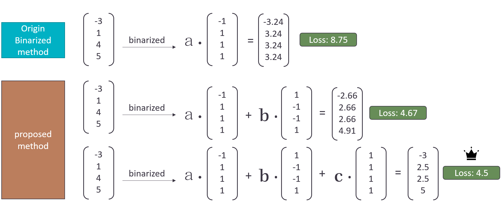

# ULTRA LOW BIT: The Multiple One-Bit Quantization

## Basic Information
Artificial Intelligence (AI) applications have become widespread, and in recent
years, they have been extensively applied on edge devices. However, the 
computational demands of deep learning models are often too great for such 
devices to handle. To address this, many applications use a method called 
quantization, which reduces model parameters to 8 bits (integer) or even fewer, 
such as one bit. 
For example, in today's popular models like transformers, most weight and 
activation ranges between -1 to 1, and the softmax output in the model is 
between 0 to 1. The numerical range between -1 and 1 is not large, and it 
has only little impact on the accuracy of the model after quantization.
In addition, one of the biggest advantages of one-bit quantization is that 
binary multiplication can be simplified to an XNOR operation, which is more 
efficient in SIMD computations.

## Problem to Solve
Running deep learning models on edge devices with one-bit quantization greatly
benefits computational efficiency but also reduces the model's precision 
significantly, which in turn, can lead to a substantial decrease in accuracy. 
Therefore, I aim to implement a "multiple one-bit" algorithm to improve 
precision while still maintaining the advantages of XNOR instructions.

## Operation Method

In the diagram above, the general approach to binary operations involves 
decomposing a value using a scaling factor 'a' along with a binary vector 
that represents +/-1 to approximate the original numerical value. My 
proposed method adds multiple sets of scaling factors and vectors of +/-1,
allowing for an even closer approximation to the original weight values. 
As shown in the graphic, this results in a lower loss, indicating a more
accurate representation.

## Engineering Infrastructure
- Version Control: Git
- Automatic Build System and Build Instructions: GNU Make
- Testing Framework: Pytest

## Schedule
- Week 1 (10/30): Set up the environment
- Week 2 (11/06): Complete the C++ version of the ULTRA LOW BIT operation
- Week 3 (11/13): Write test programs
- Week 4 (11/20): Finish the SIMD instruction-accelerated version of the program
- Week 5 (11/27): Complete testing for the SIMD instruction-accelerated version
- Week 6 (12/04): Test for performance
- Week 7 (12/11 onwards): Prepare for presentation
