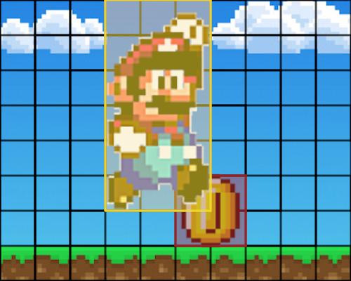
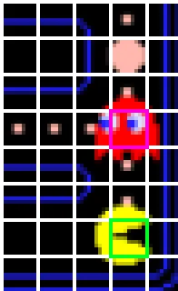

# 2D Collision Detector


## Basic Information

Simulate how different type of shape collide in a 2D map.

* github repository: [https://github.com/CodeStone1125/2DCollisionDetector](https://github.com/CodeStone1125/2DCollisionDetector)

## Problem to Solve

The problem this system wants to solve is to calculate situation for the most common shapes in 2D map like retangle, circle and Convex Polygon.

There are some algorithms can be implemented for solving this problem. Before we dive into the topic deeper, let's first talk about the the "Axis-Aligned Bounding Box" (AABB) algorithm. While it's not a single algorithm but a framework for collision detection, it forms the basis for many collision detection systems in 2D graphics and game development due to its simplicity and efficiency.

* Bounding Boxes: Each object in a 2D scene is enclosed by a rectangle (a bounding box) that is aligned with the axes of the coordinate system. These rectangles are often referred to as "AABBs" because they are aligned with the axes.

However, 2D map doesn't only contain rectangle and circle, but many different Polygons. To solve the problem, objects be divided two types that's Convex Polygon and concave polygons. And Delauney Triangulation and Hertel-Mehlhorn algorithm are used respectively to improve its efficiency.

* Delauney Triangulation:
The delauney sweepline triangulation algorithm provides a triangulation with the maximum minimum internal angle. Put more simply it produces a triangulation with fewer thin strips, while the technique is readily searchable.Implementing Delaunay triangulation from scratch is quite complex, and it typically involves advanced algorithms like the Bowyer-Watson algorithm or incremental algorithms. Here's a simplified pseudocode for an incremental Delaunay triangulation algorithm:Here is the pseudo code in `python`:

  ```python
    def delaunay_triangulation(points):
        triangulation = []  # List to store triangles
    
    # Create a supertriangle that contains all input points
    supertriangle = create_supertriangle(points)
    triangulation.append(supertriangle)
    
    for point in points:
        bad_triangles = []
        
        # Find triangles that are no longer Delaunay with the new point
        for triangle in triangulation:
            if point_inside_circumcircle(point, triangle):
                bad_triangles.append(triangle)
        
        polygon = []
        
        # Remove bad triangles from the triangulation and store their edges
        for triangle in bad_triangles:
            for edge in triangle.edges:
                if edge not in polygon:
                    polygon.append(edge)
            triangulation.remove(triangle)
        
        # Create new triangles using the edges of the polygon and the new point
        for edge in polygon:
            new_triangle = create_triangle(edge, point)
            triangulation.append(new_triangle)
    
    # Remove triangles that share vertices with the supertriangle
    return [triangle for triangle in triangulation if not triangle_shares_vertex_with_supertriangle(triangle)]

  ```

* Hertel-Mehlhorn: The simplest approach to this is the Hertel-Mehlhorn algorithm which promises to produce no more than 4 times the number of polygons of the optimal solution. In practice for simple concave polygons this algorithm often produces the optimal solution.

    The algorithm is very simple; iterate over the internal edges "diagonals" created by triangulation and remove non-essential diagonals. A non-essential diagonal is found when at either end of the diagonal the points linked would be convex. This is determined by testing the orientation of the points. Here is the pseudo code in `python`:

  ```python
  def hertel_mehlhorn(polygon):
    convex_polygons = []  # List to store resulting convex polygons
    
    while len(polygon) > 3:  # Continue until only a triangle remains
        ear_vertex = find_convex_ear_vertex(polygon)
        if ear_vertex is None:
            # Unable to find an ear vertex, the polygon is invalid
            break
        
        # Create a new convex polygon with the ear vertex and its neighbors
        new_convex_polygon = [ear_vertex.prev, ear_vertex, ear_vertex.next]
        convex_polygons.append(new_convex_polygon)
        
        # Remove the ear vertex from the polygon
        ear_vertex.prev.next = ear_vertex.next
        ear_vertex.next.prev = ear_vertex.prev
        polygon.remove(ear_vertex)
    
    # Add the remaining triangle to the list of convex polygons
    convex_polygons.append(polygon)
    
    return convex_polygons

    def find_convex_ear_vertex(polygon):
        # Find and return an ear vertex from the polygon if one exists
        # Implement the logic to check if a vertex is convex and has an "ear"
        # This involves checking the orientation of the vertices.
        # Return None if no ear vertex is found.

  ```

## Prospective users

* Game Developer: Determine whether something in a game world is attach by a character is very common in game developing. There are even games making this as one of their main features, like [Super Mario]() and [Pac-Man]()

|  |  |
|:-----------------------------------:|:-----------------------------------:|
| **Super Mario** |**Pac-Man**|

* Collision Prevention for Automation Equipment: Robots and automation devices used in industrial automation need to ensure that they do not collide or interfere with each other while performing tasks. 2D collision detection can monitor the positions of individual machine components to prevent unnecessary collisions, enhance production efficiency, and safeguard equipment.

## System Architecture

The system should provide a graphical user interface allow users to design a 2D map, place walls and move a light source to play around. Additionally, when the user is interacting with any objects on the map, the system needs to highlight the area reachable from the light source on the map in real time.

|  |
|:-----------------------------------:|
| **System flow chart** |

## API Description

* Python API:
  * `addWall(start, end)`: create a wall on the map and return its id
  * `rmWall(wall_id)`: remove the wall by its id
  * `moveLightSource(dest)`: move light source to the destination coordinate
  * `lightArea(walls, light_source)`: call the c++ api and show the lit area on the map

* C++ API:
  * `lightArea(walls, light_source)`: calculate all the areas where lights from a given single light source can reach on a 2D map and return the coordinates of the lit places and its area.

## Engineering Infrastructure

* Automatic build system: `cmake`
* Version control: `git`
* Testing framework: `pytest`
* Documentation: GitHub `README.md`

## Schedule

Planning phase (6 weeks from 9/19 to 10/31): Setup the environment and get familiar with the algorithm

Week 1 (10/31): Implement the algorithm with C++

Week 2 (11/7): Make python wrappers for C++ with `pybind`

Week 3 (11/14): Finish C++, and start creating the interactive map in python

Week 4 (11/21): Implement features of the interactive map

Week 5 (11/28): Test all features with `pytest`

Week 6 (12/5): Finish up, debug, and write the documentation

Week 7 (12/12): Buffer time for further testing and debugging

Week 8 (12/19): Make slides and prepare for the presentation

## References

* [red blob games](https://www.redblobgames.com/articles/visibility/)
* [sight and light](https://ncase.me/sight-and-light/)
