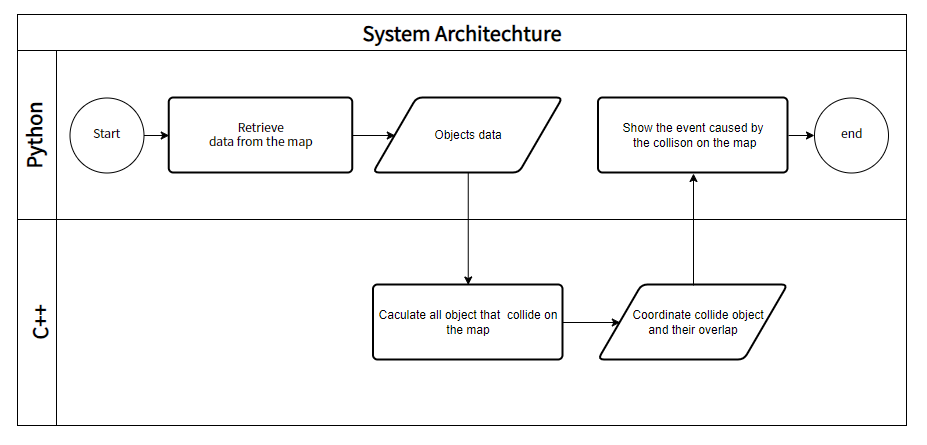

# 2D Collision Detector


## Basic Information

Simulate how different type of shape collide in a 2D map.

* github repository: [https://github.com/CodeStone1125/2DCollisionDetector](https://github.com/CodeStone1125/2DCollisionDetector)

## Problem to Solve

The objective of this system is to calculate scenarios for the most common shapes in
a 2D map, such as rectangles, circles, and polygons. Before we dive deeper into the 
topic, let's first discuss the "Axis-Aligned Bounding Box" (AABB) algorithm. While 
it's not a single algorithm but a framework for collision detection, it forms the basis
for many collision detection systems in 2D graphics and game development due to its 
simplicity and efficiency. Moreover, in the 2D world, AABB can effectively handle 
approximate collision detection for most cases. However, for more complex polygons, we 
need to introduce another algorithm called the Separating Axis Theorem (SAT). SAT is 
more precise but also more resource-intensive. For most cases in the 2D world, we can
handle collision detection through the following steps:

1. Preliminary screening of collision objects using AABB.
2. Further checking with SAT.


### AABB's Pseudo code
* Bounding Boxes: Each object in a 2D scene is enclosed by a rectangle (a bounding box)
   that is aligned with the axes of the coordinate system.These rectangles are often
   referred to as "AABBs" because they are aligned with the axes.
   Here is the pseudo code in `python`:
  
  ```python
  def calculate_aabb(points):
    if len(points) == 0:
        return None

    # Initialize min and max values with the first point
    min_x, min_y = points[0]
    max_x, max_y = points[0]

    # Iterate through the points to find the AABB
    for x, y in points:
        if x < min_x:
            min_x = x
        elif x > max_x:
            max_x = x

        if y < min_y:
            min_y = y
        elif y > max_y:
            max_y = y

    # Return the AABB as a tuple of (min_x, min_y, max_x, max_y)
    return (min_x, min_y, max_x, max_y)
  ```
### Example usage:

points = [(1, 2), (3, 4), (-1, 0), (5, 6)]

aabb = calculate_aabb(points)

print(aabb)  # Output will be the AABB: (-1, 0, 5, 6)
### SAT's Pseudo code
* Separating Axis Theorem: The Separating Axis Theorem (SAT) is a collision detection
  method for 2D shapes. It checks if there's an axis where two shapes can be separated
  , indicating no collision. If no separating axis is found, the shapes are colliding.
   SAT is used for efficient and accurate collision detection in games and simulations.
  Here is the pseudo code in `python`:
  
  ```
   def project(shape, axis):
       # Project shape vertices onto the given axis and return the range [min, max].
       min_proj = float('inf')
       max_proj = float('-inf')
    
    for vertex in shape.vertices:
        projection = dot_product(vertex, axis)
        if projection < min_proj:
            min_proj = projection
        if projection > max_proj:
            max_proj = projection
            
    return min_proj, max_proj

   def overlap(min1, max1, min2, max2):
       # Check if two ranges [min1, max1] and [min2, max2] overlap.
       return max1 >= min2 and max2 >= min1
   
   def sat_collision(shape1, shape2):
       for axis in shape1.axes + shape2.axes:
           min1, max1 = project(shape1, axis)
           min2, max2 = project(shape2, axis)
           
        if not overlap(min1, max1, min2, max2):
            # Shapes do not overlap on this axis, so they are not colliding.
            return False
    
    # If there is no axis along which the shapes do not overlap, they are colliding.
    return True
  ```

### Further research

  Even thought AABB works well for most 2D shapes but may have limitations with irregular
  polygons, circles, and very long or short shapes. Complex shapes may require additional
   techniques for accurate collision detection. So if the progress is acceptable, I'd like
  to delve deeper to achieve more precise collision detection. To solve the problem, 
  objects be divided two types that's Convex Polygon and concave polygons. And 
  Hertel-Mehlhorn algorithm as well as Delauney Triangulation are used respectively
  to improve its efficiency.

  

## Prospective users

* Game Developer: Determine whether something in a game world is attach by a character is very
  common in game developing. There are even games making this as one of their main features, like
  [Super Mario](https://zh.wikipedia.org/zh-tw/%E8%B6%85%E7%BA%A7%E9%A9%AC%E5%8A%9B%E6%AC%A7%E7%B3%BB%E5%88%97)
  and [Pokemon](https://zh.wikipedia.org/wiki/%E5%AE%9D%E5%8F%AF%E6%A2%A6%E7%B3%BB%E5%88%97#%E9%81%8A%E6%88%B2)

|  |  |
|:-----------------------------------:|:-----------------------------------:|
| **Super Mario** |**Pokemon**|

* Collision Prevention for Automation Equipment: Robots and automation devices used in industrial
   automation need to ensure that they do not collide or interfere with each other while
   performing tasks.2D collision detection can monitor the positions of individual machine
   components to prevent unnecessary collisions, enhance production efficiency, and safeguard equipment.

## System Architecture


|  |
|:-----------------------------------:|
| **System flow chart** |

## API Description

* Python API:
  * `addItem(start, end, varItem)`: create a Item on the map and return its id
  * `rmItem(item_id)`: remove the wall by its id
  * `moveItem(dest)`: move item to the destination coordinate
  * `collideObj(items)`: call the c++ api and show the events result by the items collision

* C++ API:
  * `collideObj(items)`: calculate all the items that collide on 2D map and return item id
     and events result by the items collision

## Engineering Infrastructure

* Automatic build system: `cmake`
* Version control: `git`
* Testing framework: `pytest`
* Documentation: GitHub `README.md`

## Schedule

Planning phase (6 weeks from 9/18 to 10/30): Setup the environment and get familiar with the algorithm

Week 1 (10/30): Implement the algorithm with C++

Week 2 (11/6): Make python wrappers for C++ with pybind

Week 3 (11/13): Finish C++, and start creating the interactive map in python

Week 4 (11/20): Implement features of the interactive map

Week 5 (11/27): Test all features with pytest

Week 6 (12/4): Finish up, debug, and write the documentation

Week 7 (12/11): Buffer time for further testing and debugging

Week 8 (12/18): Make slides and prepare for the presentation

## References

* [2D collision detection](https://developer.mozilla.org/en-US/docs/Games/Techniques/2D_collision_detection)
