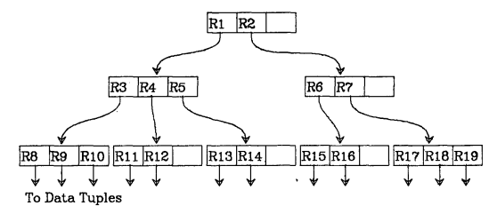
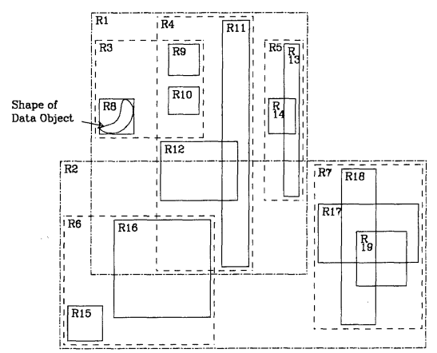

# rtreelib: A C++ R-tree Library

This is an R-tree library which implemented with C++ to achieve the performance.
If you don't know what's R-tree, you can refer to
[wiki](https://en.wikipedia.org/wiki/R-tree) [2] or original paper (Antonin
Guttman. 1984. R-trees: a dynamic index structure for spatial searching. SIGMOD
Rec. 14, 2 (June 1984), 47–57. <https://doi.org/10.1145/971697.602266>).

## Basic Information

Source code of rtreelib hosted on
[GitHub](https://github.com/ShangHungWan/rtreelib).

This library can help users to establish an R-tree easily and do other
operations like: insert, search, and delete.

The implementation follows the original paper as much as possible.

## Problem to Solve

According to the paper, R-tree is a dynamic index structure for spatial
searching. Therefore, it can help users to search for something like "What's the
nearest restaurant?", "Find all gas stations within 1km of my location".

On the contrary, if there is no R-tree, we may need to traverse all restaurants'
positions and calculate the distance between them and the user's current
location. It will be an impossible task for extremely large geographical
applications like Google Maps.

R-tree has a similar structure with B-tree. (See image 1)



> image 1. Antonin Guttman. 1984. R-trees: a dynamic index structure for spatial
> searching. SIGMOD Rec. 14, 2 (June 1984), 47–57.
> <https://doi.org/10.1145/971697.602266>

However, it was designed for higher dimensions. Ideally, this library try to
solve n-dimension problem. To elaborate the concept of R-tree better, it will
draw rectangles and find the intersections to decide which sub-tree needs to be
traversed. (See image 2)



> image 2. Antonin Guttman. 1984. R-trees: a dynamic index structure for spatial
> searching. SIGMOD Rec. 14, 2 (June 1984), 47–57.
> <https://doi.org/10.1145/971697.602266>

To handle round-off errors in the library. It will use epsilon. For example, it
will allow a small tolerance threshold when it need to check overlap or compare
the floating number.

## Prospective Users

Those who want to develop an application that needs to store/search geographical
data.

They can use both C++ and Python to include this library. C++ can directly
include the library. On the other hand, this library also provides APIs for
Python.

## System Architecture

### Interfaces

This library will provide C++ interfaces:

-   RTRect RTRect::RTRect(double top, double right, double bottom, double left)
-   RTree RTree::RTree()
-   void RTree::insert(int uid, RTRect rect)
-   int RTree::nearest(RTRect rect)
-   int\* RTree::intersection(RTRect rect)
-   void RTree::delete(int uid)

And wrap it as Python APIs:

-   RTRect RTRect::RTRect(double top, double right, double bottom, double left)
-   RTree RTree::RTree()
-   void RTree::insert(int uid, RTRect rect)
-   int RTree::nearest(RTRect rect)
-   dict[int] RTree::intersection(RTRect rect)
-   void RTree::delete(int uid)

### Testing

This library will use randomly generated geographical dataset as the input to
make sure its behavior is the same as expectation.

Moreover, in order to make sure both C++ and Python's implementations are the
same as our expectation. This library will contain unittest for both languages.

## API Description

Users can include rtreelib while compiling the code, for example:

```bash
g++ main.cpp -o main -lrtreelib
```

Furthermore, users who developing in Python can import it as well, for example:

```python
import rtreelib
```

About interfaces, please refer to [Interfaces](#interfaces).

## Engineering Infrastructure

### Build System

-   make
-   CI by GitHub Actions

### Version control

-   Git
-   GitHub
-   GitHub Flow

### Testing Framework

-   pytest (for Python)
-   Google Test (for C++)

### Documentation

-   Markdown

## Schedule

| Week           | Start Date | End Date | Description                                                                      |
| -------------- | ---------- | -------- | -------------------------------------------------------------------------------- |
| Planning phase | 10/16      | 10/29    | Keep editing and rectifying the proposal.                                        |
| Week 1         | 10/30      | 11/05    | Read the paper and survey other references to understand R-tree well.            |
| Week 2         | 11/06      | 11/12    | Implement `RTree::insert` and `RTRect`; write unit tests for them.               |
| Week 3         | 11/13      | 11/19    | Implement `RTree::nearest` and `RTree::intersection`; write unit tests for them. |
| Week 4         | 11/20      | 11/26    | Implement `RTree::delete`; write unit tests for it.                              |
| Week 5         | 11/27      | 12/03    | Write feature tests for all components.                                          |
| Week 6         | 12/04      | 12/10    | Wrap the library as Python APIs.                                                 |
| Week 7         | 12/11      | 12/17    | Write unit tests and feature tests for Python APIs.                              |
| Week 8         | 12/18      | 12/25    | Prepare the presentation and slides.                                             |

## References

-   [1] Antonin Guttman. 1984. R-trees: a dynamic index structure for spatial
    searching. In Proceedings of the 1984 ACM SIGMOD international conference on
    Management of data (SIGMOD '84). Association for Computing Machinery, New
    York, NY, USA, 47–57. <https://doi.org/10.1145/602259.602266>
-   [2] R-tree - Wikipedia. Retrieved from
    <https://en.wikipedia.org/wiki/R-tree>
-   [3] Precision of coordinates - OpenStreetMap Wiki. Retrieved from
    <https://wiki.openstreetmap.org/wiki/Precision_of_coordinates>
