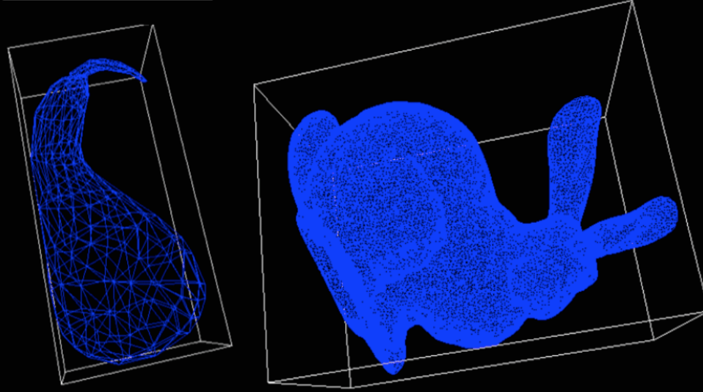
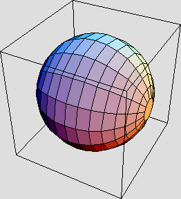
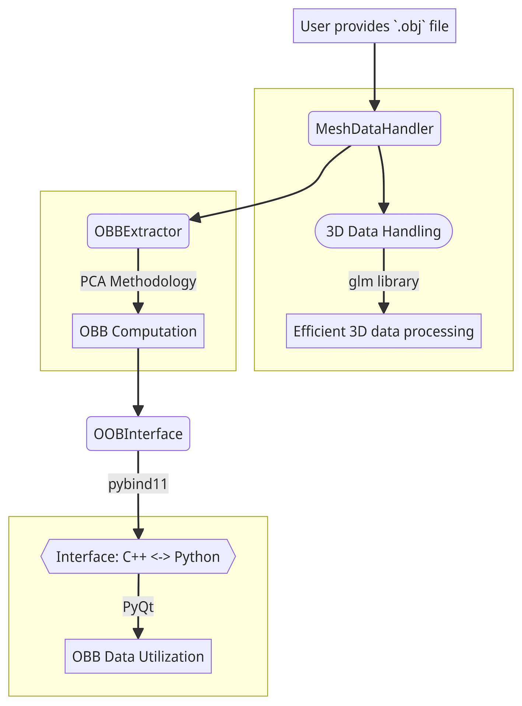

# OrientMesh Toolkit: Extracting and Visualizing Oriented Bounding Boxes from 3D Triangular Meshes

## Basic Information

> **Project Overview:** Extracting and Visualizing Oriented Bounding Boxes (OBB)
> from Triangular Meshes using C++ and Python

Triangular meshes[^1] stand as a cornerstone in computer graphics, essential in
the portrayal and animation of 3D objects. A critical aspect of processing
these meshes involves extracting **Oriented Bounding Boxes (OBB)**[^2].
_**OrientMesh Toolkit**_ presents an optimal solution to this task, fusing
efficient algorithms with an interactive visual interface. This combination
not only simplifies OBB extraction but also enhances user comprehension
through vivid visual representations.

- 📂 **GitHub Repository**: [https://github.com/Sheng08/OrientMesh-Toolkit](https://github.com/Sheng08/OrientMesh-Toolkit)
- 💻 **Implemented In**:
  - **Core Library**: C++
  - **Bindings & Interface(GUI)**: Python

## Problem to Solve

Triangular meshes, particularly when it comes to intricate surface detailing,
can be both complex and computationally intensive. Operations on these meshes
often demand significant resources. Having a precise oriented bounding box aids
in simplifying many computational geometry problems related to surface meshes,
like collision detection, mesh simplification, and many more. However,
generating an optimal OBB for surface meshes is a non-trivial task. OrientMesh
aims to offer a reliable, optimized, and easily-integrable solution for this
challenge.

<p align="center">
    
    
</p>

## Prospective Users

_**OrientMesh Toolkit**_ targets game developers, computer science students,
researchers, and professionals working with 3D models, especially in areas
requiring accurate bounding boxes like game development, simulation, and
augmented reality.

## System Architecture

_**OrientMesh Toolkit**_ utilizes C++ for its core computational tasks,
ensuring performance optimization. Moreover, Python is employed for its
bindings, making it seamlessly usable for a wider audience and also aiding
in GUI development and design.

**Components**:

- **Triangular Mesh Data Structures (C++)**: This component serves as the
  foundation, hosting the mesh structures essential for subsequent operations.
- **Algorithm for Optimal OBB Extraction (C++)**: A dedicated component that
  undertakes the crucial task of extracting the Oriented Bounding Boxes from
  the meshes.
- **API (C++ and Python)**: Interface that facilitates seamless communication
  between different modules and allows extensibility for future needs.
- **Python Bindings Using `pybind11`**: This bridges the gap between C++
  computations and Python's versatility, opening up the toolkit for a wider
  user base.
- **Interactive GUI (Python `PyQt`)**: A visual platform enabling users to
  visualize the mesh and extracted OBB interactively.

**System Flow Description**:

In the OrientMesh workflow, everything begins with the user providing 3D object
data in the form of a `.obj` file, which encapsulates information about vertices,
edges, and faces. Initially, this data is ingested and stored by the
`MeshDataHandler` class into specialized C++ data structures. Throughout this
process, we leverage both the `glm` library (OpenGL Mathematics[^3]) for
efficient handling of 3D data, and the `Eigen` library[^4] for advanced linear
algebra operations, ensuring both robustness and efficiency.

After that, the parsed data from the `MeshDataHandler` class is passed onto the
`OBBExtractor` class. Here, utilizing methodologies such as Principal Component
Analysis (PCA)[^5] with SIMD optimizations, the OBB is computed from the
provided mesh data more efficiently. The `OBBExtractor` assesses the eigen
vectors of the object's distribution to determine a 3D box that minimally
encapsulates the object.

Upon completion of the OBB extraction, all data is amalgamated through the
`OOBInterface` class. Harnessing the power of pybind11 and PyQt, marrying the
efficiency of C++ with the flexibility of Python, this interface acts as a
bridge between C++ and Python, facilitating users to conveniently access and
utilize OBB data and its associated operations.

<p align="center">
    
</p>

## Algorithm

### 3D Mesh Oriented Bounding Box (OBB) using PCA

1. **Extract vertex coordinates from the mesh**:
  ```math
  \mathbf{p}_i, \quad i = 1, 2, \ldots, N
  ```
2. **Compute the mean of the vertex coordinates**:
  ```math
  \mathbf{m} = \frac{1}{N} \sum_{i=1}^{N} \mathbf{p}_i
  ```
3. **Center the vertex coordinates**:
  ```math
  \mathbf{q}_i = \mathbf{p}_i - \mathbf{m}
  ```
4. **Compute the covariance matrix**:
  ```math
  \mathbf{C} = \frac{1}{N} \sum_{i=1}^{N} \mathbf{q}_i \mathbf{q}_i^T
  ```
5. **Decompose the covariance matrix to get the principal directions**:
  ```math
  \mathbf{C} \mathbf{v}_j = \lambda_j \mathbf{v}_j
  ```
  <p align="center">
    where $\mathbf{v}_j$ are the eigenvectors (principal directions) and
    $lambda_j$ are the eigenvalues of $\mathbf{C}$.
  </p>

6. **Project vertices onto the principal directions to get the dimensions of the OBB**:
  ```math
  D_j = \max_{i} (\mathbf{p}_i \cdot \mathbf{v}_j) - \min_{i} (\mathbf{p}_i \cdot \mathbf{v}_j), \quad j = 1, 2, 3
  ```
  <p align="center">
   where $D_1, D_2, D_3$ represent the dimensions ($L, W, H$ ) respectively.
  </p>

## API

### Environment

- `g++ w/ std >= 17` for `C++` users
    - `cmake` w/ appropriate version
    - `simd` w/ appropriate version
- `pybind11` w/ appropriate version
- `python3.10.x` or greater for `Python` users
- Required for mesh handling:
    - `.obj` file parser library w/ appropriate version

### Detail Description

For `C++` users, refer to the descriptions below. For `Python` users, most of
the `Python` type APIs are provided with the same name.

- **`MeshDataHandler`** class
    ```cpp=
    MeshDataHandler
        Constructor initializes MeshData by reading `.obj` files
        - parameters:
            obj_file (string): `.obj` file path

    ~MeshDataHandler
        Destructor

    getVertices
        Retrieve the vertices from the mesh data
        - return:
            (vector<glm::vec3>): Return list of vertices

    getEdges
        Retrieve the edges from the mesh data
        - return:
            (vector<pair<glm::vec3, glm::vec3>>): Return list of edges

    getFaces
        Retrieve the faces from the mesh data
        - return:
            (vector<vector<glm::vec3>>): Return list of faces
    ```

- **`OBBExtractor`** class
    ```cpp=
    OBBExtractor
        Constructor uses MeshDataHandler class to extract Oriented Bounding Boxes (OBB)
        - parameters:
            mesh_data_handler (MeshDataHandler): Mesh data that will be used to calculate the OBB

    ~OBBExtractor
        Destructor

    computeOBB
        Compute the OBB using Principal Component Analysis (PCA)
        - return:
            (vector<glm::vec3>): Return 8 corner vertices of OBB

    getMinimumVolume
        Calculate the minimum volume of the OBB
        - return:
            (float): Return the volume of the OBB

    getOptimalDirection
        Find the best-fit direction for the bounding box
        - return:
            (glm::vec3): Return the optimal direction vector

    getOrientation
        Retrieve the orientation of the OBB
        - return:
            (glm::quat): Return the orientation of the OBB
    ```

- **`OOBInterface`** class
    ```cpp=
    OOBInterface
        Bridge class between C++ and Python, ensuring easy accessibility to MeshDataHandler and OBBExtractor

    ~OOBInterface
        Destructor

    loadMeshData
        Load the mesh data into the interface
        - parameters:
            obj_file (string): .obj file path

    extractOBB
        Extract the oriented bounding box for the provided mesh data
        - return:
            (vector<glm::vec3>): Return 8 corner vertices of OBB

    displayInteractiveView
        Visualize and interact with the mesh and OBB
        - parameters:
            show_original_mesh (bool): Whether to show the original mesh or not
            display_obb (bool): Whether to display the OBB or not
    ```

**For Python**:

Import `_meshdatahandler`, `_obb_extractor` and `_obb_interface` for `Python` APIs.

* `MeshDataHandler` class:
    - `mesh_data = MeshDataHandler(obj_file_path)`: Initializes MeshData by
      reading `.obj` files.
    - `mesh_data.getVertices()`: Returns a list of vertices.
    - `mesh_data.getEdges()`: Returns a list of edges.
    - `mesh_data.getFaces()`: Returns a list of faces.

* `OBBExtractor` class:
    - `obb_extractor = OBBExtractor(mesh_data)`: Uses MeshDataHandler class to
      extract Oriented Bounding Boxes (OBB).
    - `obb_extractor.computeOBB()`: Computes the OBB using Principal Component
      Analysis (PCA) and returns 8 corner vertices of OBB.
    - `obb_extractor.getMinimumVolume()`: Returns the volume of the OBB.
    - `obb_extractor.getOptimalDirection()`: Returns the optimal direction vector.
    - `obb_extractor.getOrientation()`: Returns the orientation of the OBB.

* `OOBInterface` class:
    - `oob_interface = OOBInterface()`: Initializes the interface.
    - `oob_interface.loadMeshData(obj_file_path)`: Loads the mesh data into the interface.
    - `oob_interface.extractOBB()`: Extracts the oriented bounding box for the
      provided mesh data and returns 8 corner vertices of OBB.
    - `oob_interface.displayInteractiveView(show_original_mesh=True, display_obb=True)`:
      Visualizes and interacts with the mesh and OBB. The user can specify whether
      toshow the original mesh and/or the OBB.

## Engineering Infrastructure

- **Automatic Build System**:
    - [GNU make](https://www.gnu.org/software/make/manual/make.html)
    - [CMake](https://cmake.org/)
    - [Docker](https://www.docker.com)
- **Version Control**:
    - Git
    - Github
- **Testing Framework**:
    - C++: [Google Test](https://github.com/google/googletest)
    - Python: [pytest](https://docs.pytest.org/en/7.4.x/)
- **Documentation**:
    - Markdown
    - (Optional) C++: [Doxygen](https://www.doxygen.nl/)
    - (Optional) Python: [Sphinx](https://www.sphinx-doc.org/en/master/), [pydoc](https://docs.python.org/zh-tw/3/library/pydoc.html)
- **Continuous Integration**
  - [Github Actions](https://github.com/features/actions)

## Schedule

| Week                                                       | Schedule                                                                                                                                                                                                                                                                            |
| ---------------------------------------------------------- | ----------------------------------------------------------------------------------------------------------------------------------------------------------------------------------------------------------------------------------------------------------------------------------- |
| **Week 1 (11/6)**<br>Initial Setup and Environment Configuration | 1. Define project scope for OrientMesh Toolkit.<br>2. Set up GitHub repository and version control with Git.<br>3. Install the required environment (C++, Python, `pybind11`, `.obj` file parser library, etc.).                                                                    |
| **Week 2 (11/13)**<br>Mesh Data Handling                         | 1. Design and implement `MeshDataHandler` class in C++.<br>2. Test the class with various `.obj` files to ensure proper parsing and representation.<br>3. Start documentation on the class functions using Markdown.                                                                |
| **Week 3 (11/20)**<br>OBB Extraction                             | 1. Research and decide on the optimal algorithm for OBB extraction.<br>2. Begin implementation of the `OBBExtractor` class in C++.<br>3. Test the OBB extraction on sample 3D models and refine the algorithm.<br>4. Document the methods and results.                              |
| **Week 4 (11/27)**<br>Python Binding & Interface                 | 1. Explore and set up `pybind11` for creating Python bindings for C++ code.<br>2. Implement the `OOBInterface` class and Python bindings.<br>3. Test the integration of C++ and Python code and ensure seamless function call transitions.                                          |
| **Week 5 (12/4)**<br>Interactive GUI Development                 | 1. Design the GUI layout and functionalities.<br>2. Start the implementation of GUI using `PyQt` in Python.<br>3. Integrate the GUI with the core library and ensure real-time visualization of OBB and meshes.                                                                     |
| **Week 6 (12/11)**<br>Testing & Debugging                        | 1. Create test cases using Google Test for C++ and pytest for Python.<br />2. Identify bugs or inefficiencies in the code and refine them.<br />3. Optimize the performance of the extraction algorithm and GUI interactions.<br />4. Update documentation with the recent changes. |
| **Week 7 (12/18)**<br>System Documentation & Build Workflow      | 1. Finalize documentation using Markdown<br />2. Set up an automatic build system using GNU make, CMake, and Docker.<br />3. Ensure smooth build processes and fix any arising issues.<br />4. Prepare tutorials or user guides for the toolkit.                                    |
| **Week 8 (12/25)**<br>Final Review & Presentation                | 1. Review the entire project to ensure all requirements are met.<br />2. Gather feedback from beta test.<br />3. Make final adjustments based on feedback.<br />4. Prepare a presentation, focusing on key features, benefits, and potential use cases of the OrientMesh Toolkit.   |

## References
1. [Oriented Bounding Boxes in VEX](https://www.andynicholas.com/post/oriented-bounding-boxes-in-vex)
2. [cpm-glm-aabb](http://iauns.github.io/cpm-glm-aabb/class_c_p_m___g_l_m___a_a_b_b___n_s_1_1_a_a_b_b.html)
3. [Trimesh](https://trimesh.org/)
4. [PCA-OBB (GitHub Repository)](https://github.com/chuxu1793/PCA-OBB)
5. [SIMD-OBB (GitHub Repository)](https://github.com/taqu/OBB)
7. Chia-Tche Chang, Bastien Gorissen, and Samuel Melchior. 2011. Fast oriented bounding box optimization on the rotation group SO(3,ℝ). ACM Trans. Graph. 30, 5, Article 122 (October 2011), 16 pages. https://doi.org/10.1145/2019627.2019641
8. Vitsas, N., Evangelou, I., Papaioannou, G. and Gkaravelis, A. (2023), Parallel Transformation of Bounding Volume Hierarchies into Oriented Bounding Box Trees. Computer Graphics Forum, 42: 245-254. https://doi.org/10.1111/cgf.14758

[^1]: [Triangle mesh](https://en.wikipedia.org/wiki/Triangle_mesh)
[^2]: [Oriented Bounding Boxes on Wikipedia](https://en.wikipedia.org/wiki/Oriented_bounding_box)
[^3]: [OpenGL Programming/Bounding box](https://en.wikibooks.org/wiki/OpenGL_Programming/Bounding_box)
[^4]: [Eigen OBB (Library Source Code)](https://github.com/ForeverDavid/3d-workspace/blob/master/MathLibrary/Bounding/OBB.h)
[^5]: [Principal Component Analysis (PCA)](https://en.wikipedia.org/wiki/Principal_component_analysis)
