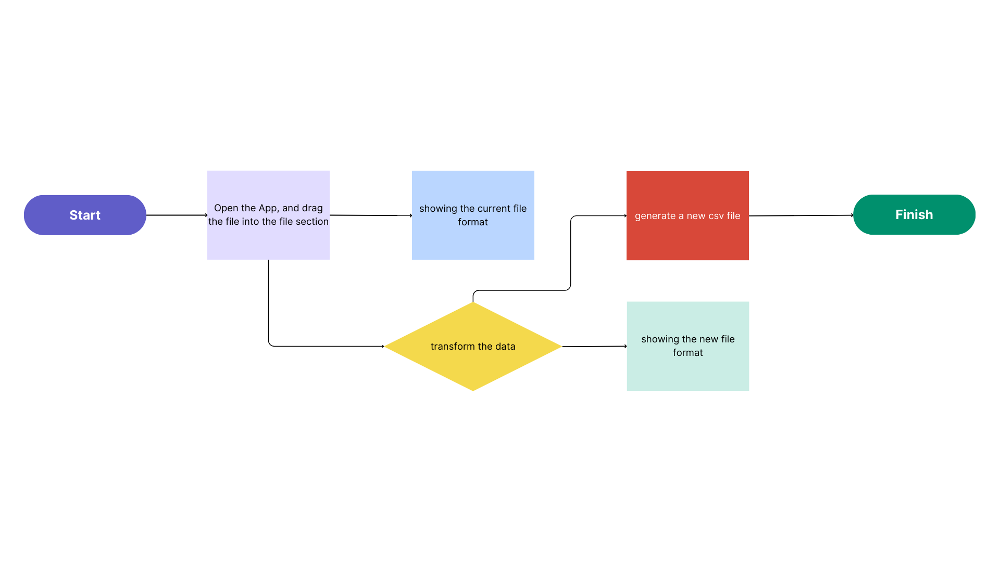

=================
Simple Transfomation from AoS to SoA
=================

This Proposal shows the work flow and plans for the 2023 Autumn NYCU NSD term project

Basic Information
=================

GitHub Link : https://github.com/leeshengcian/nsdhw_23au/tree/master/project/leeshengcian

There are generally two ways to implement arrays of composite types. 
One is to pack the composite data and use an array for them, i.e., the so-called array of struct (AoS):

.. code-block:: cpp

    struct Data
    {
        int m_field1;
        double m_field2;
    };
    
    SimpleArray<Data> data_array;

The other is to organize arrays of fundamental types, i.e., the so-called struct of arrays (SoA) or the columnar arrays:

.. code-block:: cpp

    struct StructOfArray
    {
        SimpleArray<int32_t> m_field1;
        SimpleArray<double> m_field2;
    };

The columnar array (SoA) may provide better cache locality than AoS, especially when there are many fields.

Problem to Solve
================

.. 在平常的情況下，資料通常是以AoS儲存，本專案的目的即是將資料作轉換，轉製為SoA的形式
Most of the time, data were stored in the form of AoS. However, 
sometimes we focus on the relationship between fields, which demands 
the data to be stored in SoA form.
In this work, we managed to do a simple transformation on the input data, 
in order to transform the data from Aos to SoA.

possible usage:

1. Feature Extraction in Data Mining
2. Provide a better cache locality

System Architecture
===================

Users are enabled to simply feed a csv file(in the form of AoS), 
and the system will generate another csv file, which is in the form of SoA.

API Description
===============

1. User will drag the file in the file section, and press **Start**
2. The **Start** botton will trigger the **Transform.cpp** , which start the transfomation of file
3. During the process, the input file will be decomposed, and store in another data structure
4. According to the data structure, **Transform.cpp** will reconstruct the file, save it in SoA form
5. Write the SoA form data in a new csv file, which is the **output.csv**

Engineering Infrastructure
==========================

Describe how you plan to put together the engineering system:

1. Automatic build system and how to build your program
2. Version control (show how you will use it)
3. Testing framework
4. Documentation

Some of the above information should be included in the documentation in your
software.

You may use continuous integration, but it is not required.  If you use it,
describe how it works in your code development.

Schedule
========

Itemize the work to do and list them in a timeline.  Estimate the efforts of
each item before the project starts.

The schedule is expected to be adjusted during the development.  A schedule to
accurately predict everything in the development is impossible and unnecessary.
But the initial estimate is important, for the baseline becomes concrete when
we adjust the plan.

To start, you can list the to-do items on a weekly basis and assume the
development of the project takes 8 weeks:

* Planning phase (6 weeks from mm/dd to mm/dd):
* Week 1 (mm/dd):
* Week 2 (mm/dd):
* Week 3 (mm/dd):
* Week 4 (mm/dd):
* Week 5 (mm/dd):
* Week 6 (mm/dd):
* Week 7 (mm/dd):
* Week 8 (mm/dd):

References
==========

List the external references for the information provided in the proposal.
