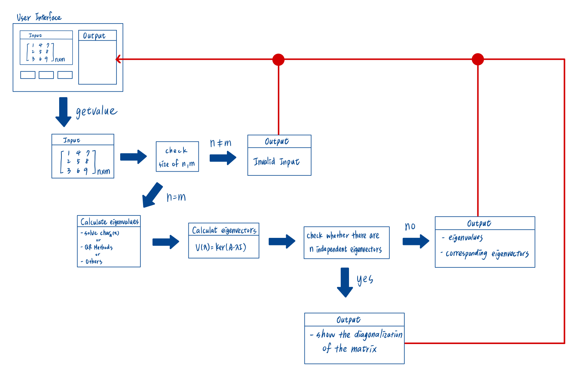

# DoSM

## Basic Information

This project will show the **Diagonalization of a Square Matrix**.  

The definition of the diagonalizable is show below,  
A square matrix A is called diagonalizable if it is similar to a diagonal matrix ($A$ ~ $D$),  
i.e., if there exists an invertible matix $P$ and a diagonal matrix $D$ such that $P^{-1}AP = D$.

Project URL: [https://github.com/yui0303/Matrix-Diagonalization](https://github.com/yui0303/Matrix-Diagonalization)


## Problem to Solve

There are several steps to do to diagonalize a square matrix.  
1. Calcualete the eigenvalues of the matrix.
2. Find the corresponding eigenvectors of eigenvalues.
3. Check whether a matrix is diagonalizable.


## How to calculate the eignvaluses and the corresponding eigenvectors
### Definition

On $A_{n\times n}$
- eigenvalue $(\lambda)$: It is a **scalar**. Exist a vector $(v \neq \vec{0})$ such that $Av = \lambda v$.
- eigenvector $(v)$: Non-zero vector $(v \neq \vec{0})$. Exist a scalar ($\lambda$) such that $Av = \lambda v$.

Note that: eigenvector cannot be $\vec{0}$, but eigenvalue can be 0.

### Computaion

- eigenvalue
    - Assume c is an eigenvalue of matrix A $\iff$ $det(A-cI) = char_{A}(c) = 0$  
    - $det(A)$ is the determinant of matrix $A$ and $char_A(x)$ is the characteristic polynomial of matrix $A$.  
- eigenvector
  - If $\lambda$ is a eigenvalue of the matrix $A$, then $V(\lambda) = \lbrace v \in V \parallel Av=\lambda v \rbrace = ker(A-\lambda I)$ is the eigenspace of $\lambda$. Note that $Ker(A)$ is the kernel space of matrix $A$.
  - Eigenvector is the non-zero vector in $V(\lambda)$.  

</br>

e.g.  

$$A=
\begin{bmatrix}
  1 & 4 \\
  5 & 0
\end{bmatrix}
$$

$$\therefore det(A-\lambda I) = 0 \Rightarrow (1-\lambda)(-\lambda) -20 = 0$$ 
$$\therefore \lambda = 5, -4$$  

$$V(5)=Ker(
\begin{bmatrix} 
  -4 & 4 \\ 
  5 & -5
\end{bmatrix}
)
= span(
\lbrace
\begin{bmatrix} 
  1 \\ 
  1 
\end{bmatrix}
\rbrace
)
$$  

$$
V(-4)=Ker(
\begin{bmatrix} 
  5 & 4 \\ 
  5 & 4
\end{bmatrix}) 
= span(
\lbrace
\begin{bmatrix} 
  4 \\
  -5 
\end{bmatrix}
\rbrace
)
$$

Therefore, we can get the

$$
\begin{bmatrix} 
  1 \\ 
  1 
\end{bmatrix}
$$

and 

$$
\begin{bmatrix} 
4 \\
-5 
\end{bmatrix}
$$ 

as eigenvectors respectively.  

### Challenges
1. Solve the characteristic polynomial.
   - Maybe use QR Decomposition to find the eigenvalues
2. Solve the Kernel space.
   - Using Gaussian Elimination
   - Other Methods?


## How to diagonalize the matrix

On $A_{n\times n}$ ,  
If the eignvalues of $A$ is $\lambda_{1}, \lambda_{2}, ..., \lambda_{n}$ and the corresponding eigenvectors are $v_1, v_2, ..., v_n$, then the diagonalization of $A$ is shown as below.  

$$
P^{-1}AP=
\begin{bmatrix}
\lambda_{1} & & & & \\
 & \lambda_{2} & & &\\
 & & . & & \\
 & & & . & \\
 & & & & \lambda_{n}
\end{bmatrix} 
,
P=
\begin{bmatrix}
  v_1 & v_2 & . & . & v_n
\end{bmatrix}
$$

**prerequisite: A has n independent eigenvectors.**

## Prospective Users

The diagonal matrix has the property that all of its off-diagonal elements are zero. There are some prospective usages for related users are shown below.

1. Solving Linear System
   - Powers of matrix, i.e., Calculate $A^{100}$.
   - SVD decomposition
   - Markov Chains
2. Some formula that contains eigenvalues or eigenvectors

## System Architecture

The flowchart of the project is shown in the image below.  



The above algorithm will be encapsulated by c++, and the algorithm also could be called by python with pybind11. 

The user interface may base on [Vue](https://vuejs.org/) or [React](https://zh-hant.legacy.reactjs.org/).

### Constraints

- Size of input matrix: default any size
  - The larger the matrix size, the higher the complexity. Thus, there may be a **TIMEOUT** mechanism during the computation.
  - This mechanism depends on the parameters previously set in the environment building (using makefile or cmakefile).
- The accerlation of the matrix operation is focus on **dense** matrix opertaion.

## API Description
The estimated API is below:
### c++
```c++
class Diagonalization{
    public:
        Diagonalization() = default;
        Diagonalization(vector<vector<double>> input);
        ~Diagonalization() = default;
        void CalEigenvalues();
        void CalEigenvectors();
        bool Diagonalizable();
        const vector<double> getEigenvalues const();
        const vector<double> getEigenvectors const();
        
        // other member functions. To be continue...
    private:
        vector<vector<double>> arr;
        vector<double> eignevalues;
        vector<double> eignevectors;
};

```

### python 
The python API will call c++ API by pybind11, and the python API can accept the numpy format as input.

## Engineering Infrastructure

1. Documentation: README.md in Github Repository
2. Automatic build system: Makefile or cmake
3. Version control: Git
4. Testing framework: Pytest
5. Wrapping: Pybind11

## Schedule

- Week 1 (10/31):  
  - Study domain knwoledges and choose the method of calculating eigenvalues.  
  - Start coding the function of `CalEigenvalues()`
- Week 2 (11/7): 
  - Finish the the function of `CalEigenvalues()`
- Week 3 (11/14): 
  - Start coding the function of `CalEigenvectors()`
  - Binding the c++ API with pybind11
  - Wrapping and test for pytest.
- Week 4 (11/21): 
  - Build the draft of makefile
  - Try how to partition the calcuation of eignevalues and eignevectors with multi-threading or other accerlation methods.
- Week 5 (11/28): 
  - Keep trying the accerlation of matrix operation.
  - Implement a complete cmake file or makefile.
- Week 6 (12/5):
  - Prepare a presentaion skeleton
  - Build the user interface and connect with the kernel function.
- Week 7 (12/12):
  - Maintain the system.
  - Keep wrting the draft of final project.
- Week 8 (12/19): Flextime.  

## References

1. [Linear-Algebra-With-Python](https://github.com/weijie-chen/Linear-Algebra-With-Python/blob/master/Chapter%2012%20-%20Eigenvalues%20and%20Eigenvectors.ipynb)
2. [Computing Eigenvalues and Eigenvectors using QR Decomposition](https://www.andreinc.net/2021/01/25/computing-eigenvalues-and-eigenvectors-using-qr-decomposition)
3. [Gaussian Elimination to Solve Linear Equations](https://www.geeksforgeeks.org/gaussian-elimination/)